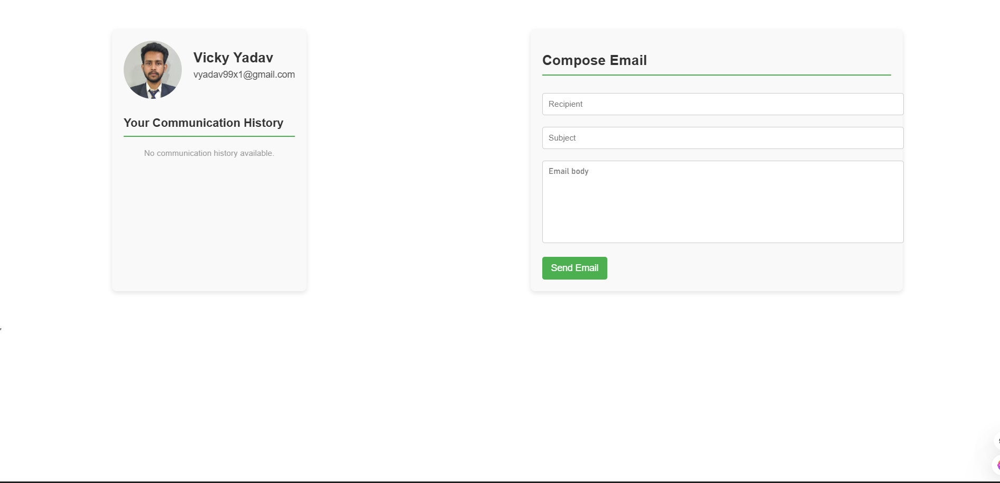
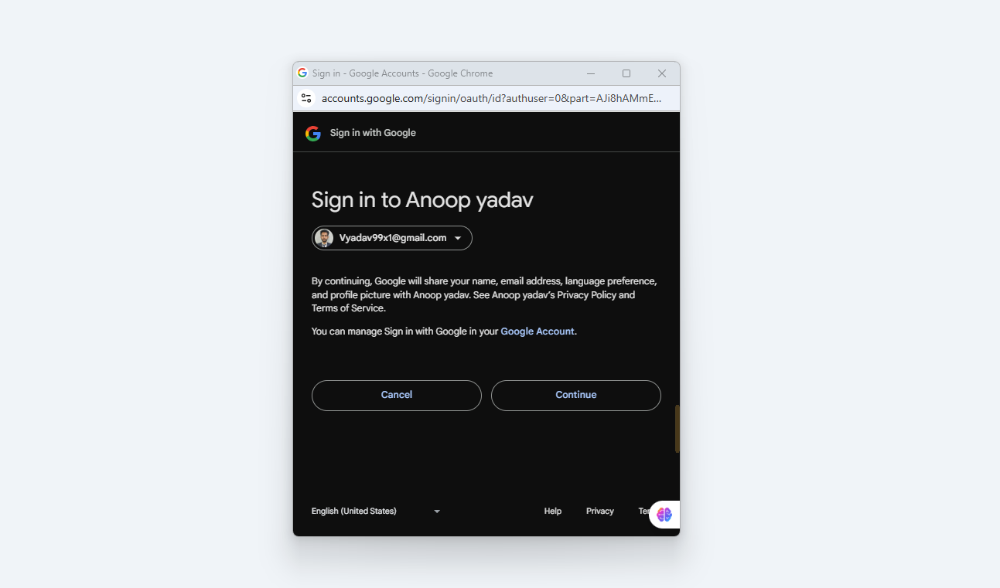

# Communication Management System 📧

A platform that allows users to manage communication effectively with features like viewing communication history, sending emails, and integrating user authentication with Google OAuth and email SaaS services with postmark.com.

[Live](https://tensor-go-assignment.vercel.app/)


## Features ✨
- **User Authentication with Google OAuth 🔐**
  Users can authenticate and log in using their Google account, ensuring a secure and seamless login experience.
  
- **View Communication History 📜** 
  Users can view their communication history, including both sent and received emails, allowing them to stay up to date with their conversations.

- **Send Emails ✉️**
  Implemented an endpoint to send emails via the Postmarkapp.com API, enabling users to send emails directly from the platform.

- **User Onboarding Emails 📧**
  Automated user onboarding emails are sent to ensure users are welcomed and guided through the platform.

- **Real-Time Activity Log** 🕒  
  Track all user activity in real-time to stay updated with ongoing tasks.

---

## Screenshots 📸

  
_Screenshot of the task management dashboard._

  
_Screenshot of the task creation form._


---

## Tech Stack 💻
- **Frontend**: React.js, Redux
- **Backend**: Node.js, Express
- **Email Service**: Postmark API, third party SaaS service for email history and commumincation (postmark.com)
- **Authentication**: Google Auth

---

## Installation Instructions 🛠️

### Prerequisites
Before you begin, ensure you have the following installed on your local machine:

- **Node.js** (v14 or above)  
  Install Node.js from [nodejs.org](https://nodejs.org/).

### Steps to Run Locally 🚀

### 1️⃣ Clone the Repository
Clone the repository to your local machine by running the following command:

```bash
$ git clone https://github.com/Vicky8180/tensorGo_assignment
$ cd tensorGo_assignment
```

### 2️⃣ Install Dependencies for frontend
```bash
$ npm install
```

### 3 Install Dependencies for backend
```bash
$ npm install
```
### 4 Environment variables configured in .env file for backend
```bash
PORT=5000
GOOGLE_CLIENT_ID=""
GOOGLE_CLIENT_SECRET=""
POSTMARK_API_KEY=""
SESSION_SECRET=""

```
### 5 Environment variables configured in .env file for both frontend 
```bash
REACT_APP_BASE_URL_PORT=http://localhost:5000
REACT_APP_CLIENT_ID=""

```
### 6 Start the Development Server
```bash
$ npm start
```
The app will be available at `http://localhost:3000`.

### 7 Build for Production
```bash
$ npm run build
```
Your optimized app will be in the `build/` directory.

## Contributing 🤝

We welcome contributions! To contribute:

1. Fork the repository.
2. Create a new branch (`git checkout -b feature-name`).
3. Make your changes and commit them (`git commit -am 'Add feature'`).
4. Push to the branch (`git push origin feature-name`).
5. Open a Pull Request to the main repository.

---

## License 📄

This project is licensed under the MIT License - see the [LICENSE](LICENSE) file for details.

---

